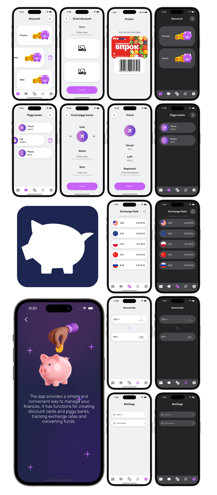

## **Piggy bank**

Piggy Bank is an iOS app designed to simplify financial management tasks. It offers features such as creating discount cards and piggy banks, tracking exchange rates, and converting funds.

## Screenshots

## About

The graphical interface and navigation of the application are implemented using code. The architecture of the application follows the MVVM architectural pattern. CoreData is used for storing data. The application supports both light and dark themes.

## Used libraries

- [x] CoreData
- [x] Alamofire

## Features

- [x] Showing the best currency exchange rates.
- [x] Currency converter for calculating amounts.

## Links

[Figma layout](https://www.figma.com/file/EZjydRTyUtmXL3yOtj16uY/Piggy-bank?type=design&node-id=0%3A1&mode=design&t=kFmvL7INTyBy1uyE-1)

## Requirements

- iOS 15.0+
- Xcode 15.0+
  
## License

This project is available under the MIT license. See the LICENSE file for more info.

## Authors
- Daniil Yushkevich: [https://www.linkedin.com/in/dyushkevich](https://www.linkedin.com/in/dyushkevich/)
